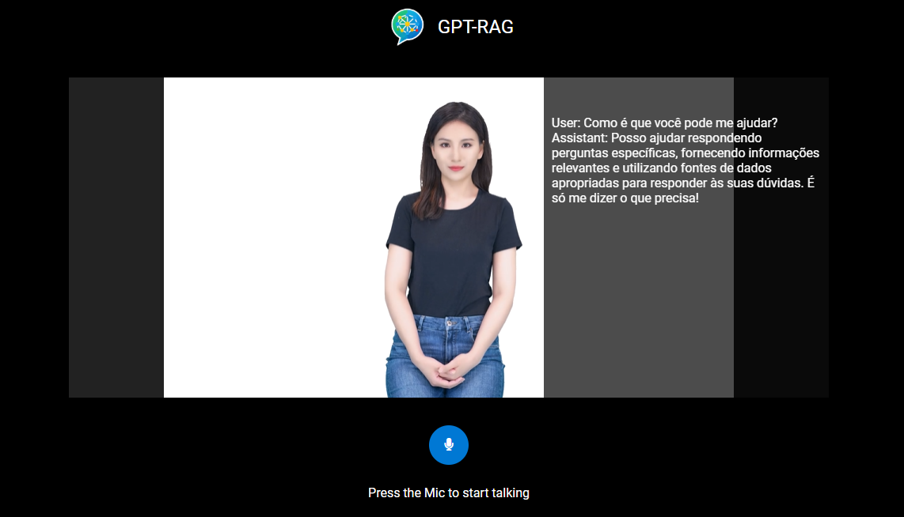

# gpt-rag-avatar

**gpt-rag-avatar** is an interactive FastAPI-based application that brings together GPT-powered responses, voice recognition, and text-to-speech capabilities using Azure services. The project leverages Azure App Service for hosting, Azure Key Vault, and Azure Speech API for voice interactions. 



---

## Features

- **Interactive Avatar:** Provides GPT-powered responses via a talking avatar interface.
- **Voice Interaction:** Integrates Azure Speech API for both speech recognition and text-to-speech.
- **Secure Secrets Management:** Uses Azure Key Vault to securely manage sensitive configuration data.
- **Optional Authentication:** Supports MSAL-based authentication.
- **Streaming Support:** The orchestrator (agentic orchestrator) supports streaming responses for real-time interactions.

---

## Prerequisites

- **Python 3.12**
- **Azure CLI:** Ensure you are logged in with `az login`.
- An existing **Azure App Service** and **App Service Plan**.
- An **Azure Key Vault** with the required secrets configured.

> [!IMPORTANT]
> Avatar uses gpt-rag agentic orchestrator, that supports streaming used in real-time voice interactions.

---

## Installation

1. **Clone the Repository:**

   ```bash
   git clone https://your-repo-url.git
   cd gpt-rag-avatar
   ```

2. **Create a Virtual Environment and Install Dependencies:**

You can use either Python's built-in `venv` or Conda to create your environment.

   ```bash
   python -m venv venv
   source venv/bin/activate   # On Windows use: venv\Scripts\activate
   pip install -r requirements.txt
   ```

2.1. Using venv

   ```bash
   python -m venv venv
   source venv/bin/activate   # On Windows use: venv\Scripts\activate
   pip install -r requirements.txt
   ```

2.2. Using Conda

   ```bash
   conda create -n gpt-rag-avatar python=3.12
   conda activate gpt-rag-avatar
   pip install -r requirements.txt
   ```

3. **Configure Environment Variables:**

   Copy the provided template to create your own configuration file:

   ```bash
   cp .env.template .env
   ```

   Then, edit `.env` with your specific settings.

---

## Environment Variables

Set the following environment variables in your `.env` file (or via the App Service's Application Settings) and group them by category:

### General

- **AZURE_KEY_VAULT_NAME:** Your Azure Key Vault name.

### Authentication

- **ENABLE_AUTHENTICATION:** `"true"` to enable MSAL-based authentication; otherwise `"false"`.
- **CLIENT_ID:** The Azure AD Application (Client) ID.
- **AUTHORITY:** The authority URL (e.g., `https://login.microsoftonline.com/your_tenant_id`).
- **REDIRECT_PATH:** The authentication redirect path (e.g., `/auth`).
- **REDIRECT_URI:** The full redirect URI (e.g., `http://localhost:8000/auth`).
- **ADDITIONAL_SCOPES:** (Optional) Comma-separated list of extra scopes.

### Azure Speech API

- **AZURE_SPEECH_REGION:** The region for your Azure Speech API (e.g., `westus2`).
- **SUPPORTED_LANGUAGES:** Comma-separated list of supported languages (e.g., `en-US,de-DE,zh-CN,nl-NL`).

### Orchestrator

- **STREAMING_ENDPOINT:** URL endpoint for the orchestrator’s streaming API.

---

## Azure Key Vault Secrets

For secure operation, create the following secrets in your Azure Key Vault:

- **avatarSessionSecretKey:** The secret key used for session management.
- **avatarOrchestratorFunctionKey:** The function key required to access the orchestrator service.
- **avatarSpeechApiKey:** Your Azure Speech API key.
- **avatarMsalClientSecret:** The MSAL client secret for authentication.

Also, ensure that the App Service's managed identity is granted permission to get these secrets from the Key Vault.

---

## Deployment to Azure App Service

Assuming your App Service and App Service Plan are already created, follow these steps:

1. **Prepare Your Deployment Package:**

   Zip your project files (exclude the virtual environment and local configuration files):

   ```bash
   zip -r deployment.zip . -x "venv/*" ".env"
   ```

2. **Deploy Using Azure CLI:**

   ```bash
   az webapp deployment source config-zip --resource-group <YourResourceGroup> --name <YourAppServiceName> --src deployment.zip
   ```

3. **Configure App Settings:**

   - Navigate to your App Service in the [Azure Portal](https://portal.azure.com).
   - Go to **Configuration** > **Application Settings**.
   - Add the environment variables listed above.
   - **Set the Startup Command:**  
     In the App Service settings, set the startup command to:
     ```bash
     uvicorn main:app --host=0.0.0.0 --port=$PORT
     ```
   - Save your changes and restart the app.


---

## Running Locally

1. **Set Up Environment Variables:**

   Ensure your `.env` file is correctly configured.

2. **Run the Application:**

   ```bash
   uvicorn main:app --reload
   ```

   Access the app at [http://localhost:8000](http://localhost:8000).